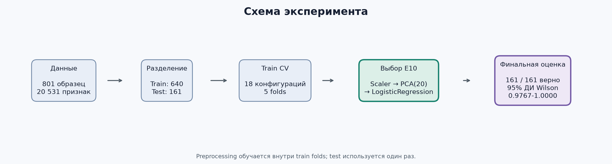

# Классификация типов опухолей по данным RNA-Seq

[](https://github.com/svetsss/cancer-rnaseq-classifier/actions/workflows/checks.yml)


**Автор:** Старинская Светлана Романовна<br>
**Курс:** 2 курс<br>
**Группа:** ФИИТ

Проект классифицирует образцы RNA-Seq по профилю экспрессии генов. Для каждого образца
модель определяет один из пяти классов опухолевой ткани: BRCA, COAD, KIRC, LUAD или PRAD.

[Jupyter notebook](notebooks/model_comparison_demo.ipynb) ·
[Streamlit-приложение](https://sdgmbqy9xnjjsjbkbyvyzr.streamlit.app/) ·
[все метрики](results/metrics.csv) ·
[методика](docs/experiment_log.md) ·
[ограничения](#ограничения)

## Краткий результат

| Этап | Результат |
|---|---:|
| Датасет | 801 образец, 20 531 признак, 5 классов |
| Сравнение | 18 конфигураций на train cross-validation |
| Выбранная модель | E10: `StandardScaler → PCA(20) → LogisticRegression` |
| Repeated CV E10 | Macro F1 `0.9980 ± 0.0045`, 50 validation folds |
| Зафиксированный test | 161 / 161 верно, macro F1 `1.0000` |
| Неопределённость accuracy | 95% интервал Wilson `0.9767–1.0000` |

Точная test-метрика относится к одной заранее зафиксированной выборке. Repeated CV
и доверительный интервал добавлены, чтобы показать разброс и неопределённость оценки.

## Быстрый запуск

```bash
python3 -m venv .venv
source .venv/bin/activate
python -m pip install -e ".[app,model-runtime]"
streamlit run app.py
```

Для просмотра экспериментов без запуска моделей откройте
[model_comparison_demo.ipynb](notebooks/model_comparison_demo.ipynb): в нём уже сохранены
таблицы и графики.

## Ограничения

Модель обучена и оценена на одном датасете UCI. Независимая когорта, batch effects и
переносимость между лабораториями не исследовались. Результат `1.0000` относится только к
зафиксированному test split и не является показателем клинической применимости.

Подробнее: [ограничения проекта](docs/limitations.md) и
[протокол внешней валидации](docs/external_validation_protocol.md).

## Функциональность

- автоматическая загрузка и проверка целостности датасета UCI;
- анализ распределения классов и качества данных;
- воспроизводимое разделение данных на train и test;
- сравнение классических моделей и нейронной сети;
- отбор признаков с помощью `SelectKBest` и снижение размерности с помощью PCA;
- cross-validation с преобразованиями внутри каждого fold;
- сохранение метрик, графиков, предсказаний и обученного Pipeline;
- Jupyter notebooks для анализа и демонстрации проекта;
- Streamlit-интерфейс для просмотра результатов и проверки модели.

## Экспериментальный протокол



Последовательность работы:

1. матрица RNA-Seq проходит проверку структуры и целостности;
2. выполняется стратифицированное разделение 80/20;
3. модели сравниваются только на train-части с помощью 5-fold cross-validation;
4. выбранный Pipeline обучается на полном train и оценивается на test;
5. метрики, predictions, модель и графики сохраняются как артефакты проекта.

## Контроль корректности

| Риск | Как он контролируется |
|---|---|
| Утечка данных | `StandardScaler`, PCA и `SelectKBest` входят в Pipeline и обучаются заново внутри каждого fold |
| Подгонка под test | E10 зафиксирован в [final_candidate.json](results/final_candidate.json) до однократной test-оценки |
| Невоспроизводимое разделение | `random_state=42`, стратификация и SHA-256 индексов хранятся в [split_summary.json](results/split_summary.json) |
| Случайный удачный split | E10 дополнительно проверен на 50 validation folds |
| Подмена артефактов | Модель, predictions, report и confusion matrix проверяются по SHA-256 командой `python -m scripts.verify_artifacts` |
| Дрейф кода | CI на Python 3.11 и 3.12 запускает Ruff, mypy, проверку артефактов, notebook и pytest |

## Датасет

Используется набор данных
[Gene Expression Cancer RNA-Seq](https://archive.ics.uci.edu/dataset/401/gene+expression+cancer+rna+seq)
из UCI Machine Learning Repository.

Характеристики датасета:

| Параметр | Значение |
|---|---:|
| Образцы | 801 |
| Признаки экспрессии | 20 531 |
| Классы | 5 |
| Пропущенные значения | 0 |
| Константные признаки | 267 |

Классы:

- `BRCA` — инвазивная карцинома молочной железы;
- `COAD` — аденокарцинома толстой кишки;
- `KIRC` — светлоклеточный рак почки;
- `LUAD` — аденокарцинома лёгкого;
- `PRAD` — аденокарцинома предстательной железы.


BRCA — самый крупный класс: 300 образцов. Самый малочисленный класс COAD содержит 78
образцов, поэтому основной метрикой выбрана macro F1: она одинаково учитывает каждый класс.

## Модели

В экспериментальной части сравниваются:

- `DummyClassifier`;
- `LogisticRegression`;
- `LinearSVC`;
- `RandomForestClassifier`;
- многослойный перцептрон на PyTorch.

Основная метрика — `macro F1`, поскольку классы представлены в датасете неравномерно.
Модели оцениваются с помощью стратифицированной 5-fold cross-validation на train-части.
Стандартизация, PCA и отбор признаков входят в Pipeline и обучаются отдельно внутри
каждого fold.

Лучшая конфигурация классической модели:

```text
StandardScaler
PCA(n_components=20, random_state=42)
LogisticRegression(max_iter=3000, random_state=42)
```

Основные результаты train cross-validation:

| Эксперимент | Модель | Представление | CV macro F1 |
|---|---|---|---:|
| E01 | LogisticRegression | 20 531 признаков | 0.9954 ± 0.0065 |
| E08 | LinearSVC | SelectKBest, 200 | 1.0000 ± 0.0000 |
| E10 | LogisticRegression | PCA, 20 | 1.0000 ± 0.0000 |
| E16 | Random Forest | SelectKBest, 200 | 0.9961 ± 0.0032 |
| E17 | PyTorch MLP | SelectKBest, 200 | 0.9987 ± 0.0026 |


Точка показывает средний macro F1 по пяти folds, горизонтальный отрезок — стандартное
отклонение. E08 и E10 получили максимальный результат. Для финального Pipeline выбран E10
с представлением из 20 PCA-компонент.

<details>
<summary><strong>Полная таблица 18 экспериментов</strong></summary>

| ID | Модель | Представление | CV macro F1 | CV accuracy |
|---|---|---|---:|---:|
| E00 | DummyClassifier | 20 531 признак | 0.1091 ± 0.0000 | 0.3750 |
| E01 | LogisticRegression | 20 531 признак | 0.9954 ± 0.0065 | 0.9953 |
| E02 | LogisticRegression | SelectKBest, 50 | 0.9974 ± 0.0032 | 0.9969 |
| E03 | LogisticRegression | SelectKBest, 100 | 0.9961 ± 0.0032 | 0.9953 |
| E04 | LogisticRegression | SelectKBest, 200 | 0.9974 ± 0.0032 | 0.9969 |
| E05 | LogisticRegression | SelectKBest, 500 | 0.9987 ± 0.0027 | 0.9984 |
| E06 | LinearSVC | SelectKBest, 50 | 0.9987 ± 0.0026 | 0.9984 |
| E07 | LinearSVC | SelectKBest, 100 | 0.9987 ± 0.0026 | 0.9984 |
| E08 | LinearSVC | SelectKBest, 200 | 1.0000 ± 0.0000 | 1.0000 |
| E09 | LinearSVC | SelectKBest, 500 | 1.0000 ± 0.0000 | 1.0000 |
| E10 | LogisticRegression | PCA, 20 | 1.0000 ± 0.0000 | 1.0000 |
| E11 | LogisticRegression | PCA, 50 | 0.9987 ± 0.0027 | 0.9984 |
| E12 | LogisticRegression | PCA, 100 | 0.9987 ± 0.0027 | 0.9984 |
| E13 | LinearSVC | PCA, 20 | 0.9987 ± 0.0025 | 0.9984 |
| E14 | LinearSVC | PCA, 50 | 0.9889 ± 0.0122 | 0.9922 |
| E15 | LinearSVC | PCA, 100 | 0.9912 ± 0.0082 | 0.9938 |
| E16 | RandomForestClassifier | SelectKBest, 200 | 0.9961 ± 0.0032 | 0.9953 |
| E17 | PyTorchMLP | SelectKBest, 200 | 0.9987 ± 0.0026 | 0.9984 |

</details>

Исходные значения с полной точностью хранятся в [results/metrics.csv](results/metrics.csv).

### Почему выбран E10

E08, E09 и E10 получили одинаковый train CV macro F1 `1.0000`. Правило выбора было
уточнено после методологического ревью и применяется только к train CV:

1. максимальный CV macro F1;
2. меньшее стандартное отклонение macro F1;
3. более простое семейство классификатора;
4. более простой метод представления;
5. меньшая размерность только внутри одного метода представления.

По этому правилу E10 остаётся выбранным: при равных среднем и стандартном отклонении
LogisticRegression имеет приоритет как более простой классификатор. Число PCA-компонент не
сравнивается напрямую с количеством генов SelectKBest. PCA обучается на всех 20 531 исходных
признаках: 20 компонент не означают 20 отдельных генов. Логистическая регрессия также
возвращает вероятности классов, которые показываются в Streamlit.

Историческая запись выбора до test не переписывается; причина и границы исправления описаны в
[методологических примечаниях](docs/methodology_corrections.md). Итоговая конфигурация E10 и
зафиксированная test-оценка от уточнения правила не изменились.

### Итоговый Pipeline

| Элемент | Значение |
|---|---|
| Вход | 20 531 числовой признак RNA-Seq в зафиксированном порядке |
| Preprocessing | `StandardScaler` и `PCA(n_components=20, random_state=42)` |
| Классификатор | `LogisticRegression(max_iter=3000, random_state=42)` |
| Выход | Класс BRCA, COAD, KIRC, LUAD или PRAD и вероятности классов |
| Артефакт | [final_e10_pipeline.joblib](models/final_e10_pipeline.joblib), контрольная сумма зафиксирована в `final_evaluation.json` |

### Проверка устойчивости E10

Дополнительно E10 проверен с помощью `RepeatedStratifiedKFold`: 10 повторов по 5 folds,
всего 50 оценок на train-части. Зафиксированный test set в этом анализе не использовался.

| Показатель | Значение |
|---|---:|
| Число оценок | 50 |
| Macro F1, mean ± std | 0.9980 ± 0.0045 |
| Минимальный Macro F1 | 0.9873 |
| Максимальный Macro F1 | 1.0000 |


Каждая точка соответствует одному validation fold, пунктир показывает среднее значение.
Высокий результат сохраняется при разных разбиениях train-выборки, однако такая проверка
не заменяет оценку на независимой когорте.

### Как меняется представление данных

Перед LogisticRegression признаки стандартизируются, затем PCA преобразует 20 531 исходный
признак в 20 компонент. Ниже показана двумерная проекция train-выборки только для визуального
анализа расположения классов.


Цвет обозначает класс опухолевой ткани. На проекции особенно хорошо отделяется KIRC;
остальные классы частично пересекаются в двух измерениях. Финальная модель использует 20
компонент, поэтому эта двумерная картинка является только иллюстрацией структуры данных.

## Анализ обучения MLP

Для MLP сохраняются `train loss`, `validation loss`, `validation macro F1` и accuracy после
каждой эпохи. Early stopping выполняется отдельно в каждом внешнем fold.

| Fold | Выбранная эпоха | Остановка | Macro F1 | Accuracy |
|---:|---:|---:|---:|---:|
| 1 | 19 | 29 | 0.9935 | 0.9922 |
| 2 | 16 | 26 | 1.0000 | 1.0000 |
| 3 | 4 | 14 | 1.0000 | 1.0000 |
| 4 | 4 | 14 | 1.0000 | 1.0000 |
| 5 | 11 | 21 | 1.0000 | 1.0000 |

Средний CV macro F1 обновлённого MLP-протокола: `0.9987 ± 0.0026`.

### Динамика функции потерь


Синяя линия показывает средний train loss, оранжевая — средний validation loss. Заливка
показывает диапазон значений между folds. Обе кривые быстро снижаются в первые эпохи.

### Macro F1 по эпохам


Зелёная линия показывает средний validation macro F1, заливка — минимальное и максимальное
значение среди folds. Уже на первых эпохах среднее превышает 0.98, затем достигает 1.0.

### Выбор эпохи и early stopping


Синие колонки обозначают эпоху с минимальным validation loss. Жёлтые колонки показывают
момент остановки после `patience = 10`. Разное число эпох по folds подтверждает пользу
отдельного early stopping для каждого разбиения.

### Метрики по folds


Зелёные колонки — macro F1, фиолетовые — accuracy на outer-validation. В первом fold
получены 0.9935 и 0.9922, в остальных четырёх folds обе метрики равны 1.0.

## Результаты

Финальная модель обучена на 640 train-образцах и оценена на 161 test-образце.

| Метрика | Значение |
|---|---:|
| Macro F1 | 1.000000 |
| Accuracy | 1.000000 |
| Precision macro | 1.000000 |
| Recall macro | 1.000000 |

| Класс | Precision | Recall | F1 | Образцы |
|---|---:|---:|---:|---:|
| BRCA | 1.0000 | 1.0000 | 1.0000 | 60 |
| COAD | 1.0000 | 1.0000 | 1.0000 | 16 |
| KIRC | 1.0000 | 1.0000 | 1.0000 | 30 |
| LUAD | 1.0000 | 1.0000 | 1.0000 | 28 |
| PRAD | 1.0000 | 1.0000 | 1.0000 | 27 |

95% интервал Wilson для accuracy: `0.9767–1.0000`.


Все значения находятся на главной диагонали confusion matrix: 161 test-образец отнесён к
своему классу. Числа в строках соответствуют фактическому количеству объектов каждого
класса в test-выборке.

Полные результаты экспериментов находятся в [results](results), а описание протокола — в
[журнале экспериментов](docs/experiment_log.md). Процедура проверки на независимой когорте
описана в [протоколе внешней валидации](docs/external_validation_protocol.md).

## Jupyter notebook

- [cancer_rnaseq_project.ipynb](notebooks/cancer_rnaseq_project.ipynb) — полный разбор
  датасета, моделей и результатов;
- [model_comparison_demo.ipynb](notebooks/model_comparison_demo.ipynb) — компактная
  демонстрация схемы эксперимента, сравнения моделей, метрик, таблиц и
  анализа эпох MLP.

## Структура проекта

```text
.
├── src/                 # загрузка данных, модели и оценка
├── scripts/             # запуск этапов эксперимента
├── notebooks/           # исследовательский и демонстрационный notebooks
├── results/             # сохранённые метрики и предсказания
├── figures/             # графики с результатами экспериментов
├── models/              # обученный sklearn Pipeline
├── docs/                # методика и описание экспериментов
├── requirements/        # зафиксированное окружение модели
├── tests/               # автоматические тесты
├── .github/workflows/   # CI для Python 3.11 и 3.12
├── app.py               # Streamlit-приложение
└── pyproject.toml        # зависимости и настройки проекта
```

## Технологии

- Python 3.11–3.12;
- NumPy и pandas;
- scikit-learn;
- PyTorch;
- Matplotlib;
- JupyterLab;
- Streamlit;
- pytest, Ruff и mypy.

## Установка

Клонирование репозитория:

```bash
git clone https://github.com/svetsss/cancer-rnaseq-classifier.git
cd cancer-rnaseq-classifier
```

Создание виртуального окружения:

```bash
python3 -m venv .venv
source .venv/bin/activate
```

Для Windows:

```powershell
python -m venv .venv
.venv\Scripts\activate
```

Установка проекта с инструментами анализа и тестирования:

```bash
python -m pip install --upgrade pip
python -m pip install -e ".[dev,neural,notebook]"
```

## Запуск анализа

Основные этапы запускаются последовательно:

```bash
python -m scripts.analyze_dataset
python -m scripts.run_baselines
python -m scripts.run_feature_selection
python -m scripts.run_extended_experiments
python -m scripts.run_mlp_training_analysis --publish
python -m scripts.run_robustness_analysis --repeats 10 --publish
python -m scripts.build_project_assets
```

Новые результаты сохраняются в каталоге `runs/`, а опубликованные результаты в `results/`
остаются зафиксированными.

Запуск JupyterLab:

```bash
jupyter lab
```

Пересборка и выполнение демонстрационного notebook:

```bash
python -m scripts.build_comparison_notebook
jupyter nbconvert --to notebook --execute --inplace \
  notebooks/model_comparison_demo.ipynb \
  --ExecutePreprocessor.timeout=180
```

## Streamlit-приложение

Для приложения с сохранённой моделью используется Python 3.12.x и зафиксированное
окружение модели:

```bash
python -m pip install -e ".[app,model-runtime]"
streamlit run app.py
```

Приложение содержит:

- обзор датасета;
- таблицу экспериментов с фильтрами;
- итоговые метрики и confusion matrix;
- техническую проверку обученного Pipeline на подготовленной матрице признаков.

## Проверка проекта

```bash
python -m pip check
python -m ruff format --check .
python -m ruff check .
python -m mypy src
python -m scripts.verify_artifacts
jupyter nbconvert --to notebook --execute \
  notebooks/model_comparison_demo.ipynb \
  --output-dir /tmp \
  --ExecutePreprocessor.timeout=180
python -m pytest -q
```

## Источник данных

Fiorini, S. (2016). *Gene Expression Cancer RNA-Seq*. UCI Machine Learning Repository.
[https://doi.org/10.24432/C5R88H](https://doi.org/10.24432/C5R88H)
